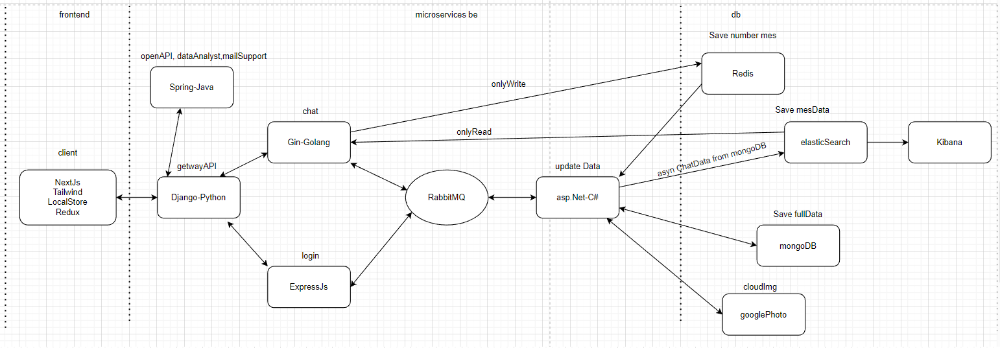

# Ứng dụng web chat
Mô hình MVC
+ M: ASP.NET -v:7
+ V: NEXTJS -v:13
+ C: NODE -v:18
---------------------------------
+ Công nghệ sử dụng: nodejs, nextjs, asp.net, rabbitmq, elasticSearch, redis, googleAPI, mongodb, googleAPI
+ nextjs: Hiển thị dữ liệu.
+ nodejs: Điều khiển sự tương tác của nextjs và asp.
+ asp: Quản lí xử lí các dữ liệu.
+ rabbitmq: Nhận và gửi msg theo event để truyền dữ liệu từ node sang asp.
+ elasticSearch: Tối ưu việc search dữ liệu.
+ redis: Lưu trữ dữ liệu thường xuyên update.
+ mongodb: Hệ quản trị cơ sở dữ liệu.
+ googleAPI: Lưu trữ dữ liệu.
+ kibana: Giao diện cho elasticSearch
----------------------------------
Các bước để chạy: 
+ bước 1 cài node:v18.14.2, nextjs v13.4.12, asp v7.0, mongodb(server,compass), redis(services,redisinsght),rabbitmq 3.12.4, elasticSearch v8.9.1, kibana -v8.9.1. (Cài đúng version để đảm bảo ít lỗi có thể sảy ra nhất)
+  mongodb(server,compass), redis(services,redisinsght),rabbitmq 3.12.4, elasticSearch v8.9.1, kibana -v8.9.1 có thể chạy = file docker-compose
+  1.1 Cài docker ( search ) -> chạy docker
+  1.2 Kiểm trả có port của các service trong file docker-compose có trống không, nếu không phải tắt hoặc đổi port trên file ( đổi luôn trong code )
+  1.3 Mở thư mục chứa file chạy lệnh "docker-compose up" và chờ
+  1.4 Vào docker check service chạy ổn chưa ( có thêm nhiều cách khác để check -> search )
+  1.5 Xem service chạy bằng terminal || hoặc giao diện (search)
+ bước 2 đảm các các services trên để đã chạy trên máy.
+ bước 3 clone dự án: mở teminal service nextjs, nodejs dùng lệnh npm i -> npm run dev để cài pakage còn thiếu và chạy dự án trên môi trường dev, với service asp thì dotnet watch
+ bước 4 kiểm tra service đã hoạt động chưa: http://localhost:5000/apiGetway/login/checkserver,http://localhost:5000/apiGetway/chat/checkserver với node, còn next thì check localhost:3000, asp thì xem ở trong mongo đã tự tạo database appChat và có các collection chưa. 127.0.0.1:9200 với elastic, 127.0.0.1:5601 kibana, còn redis thì vào redisinsght add redis db local (port 6379) xem được không.
+ bước 5 check thử api xem luồn hoạt động: post http://localhost:5000/apiGetway/login/senddata | json {
    "type":"create",
    "msg":{
        "username":"huyqaz",
        "password":"xxx",
        "email":"abc@gmail.com",
        "avatar":"xxx",
        "_id":""
    }
} res === true thì đã thành công sau đó vào mongodb và elasticSearch kiểm tra đã có user mới được tạo chưa.
-----------------------------------
Cách sử dụng:
+ Người dùng vào client phải login để có quyền sử dụng, nếu chưa có account thì tạo người dùng mới rồi login để có quyền sử dụng appChat, người dùng không hoạt động sau 1 time nào đó phải login lại.
  
Chức năng dự kiến:
+ Gửi msg realtime ( 1 người , cả nhóm).
+ Gửi img, sticker và emoji, vị trí.
+ Tùy chỉnh giao diện, thông báo tin nhắn.
+ Tìm kiếm tin nhắn
+ Gọi thoại
  
Luồn hoạt động từng service:
+ nextClient: Giao diện
+ expressLogin: Sử lí login,register| khi api được gọi từ client service sẽ get data từ elastichSearch rồi return 'nextClient' {true||false} (login) || send msg {type:...,info...} đến 'aspUpdate' (register)
+ expressChat: Sử lí các chức năng của app|| call redis(read||write) data, elastic(only read), send msg {type:...,info...} đến 'aspUpdate' (save infoChat)
+ aspUpdate: Sự lí data theo event| Nhận msg từ sercice khác rồi hanele: save data vào mongo(only write), sync data from mongo to elastic, save data(img) google.
+ aspAPI: Quản lí api từ các service
------------------------------------

------------------
